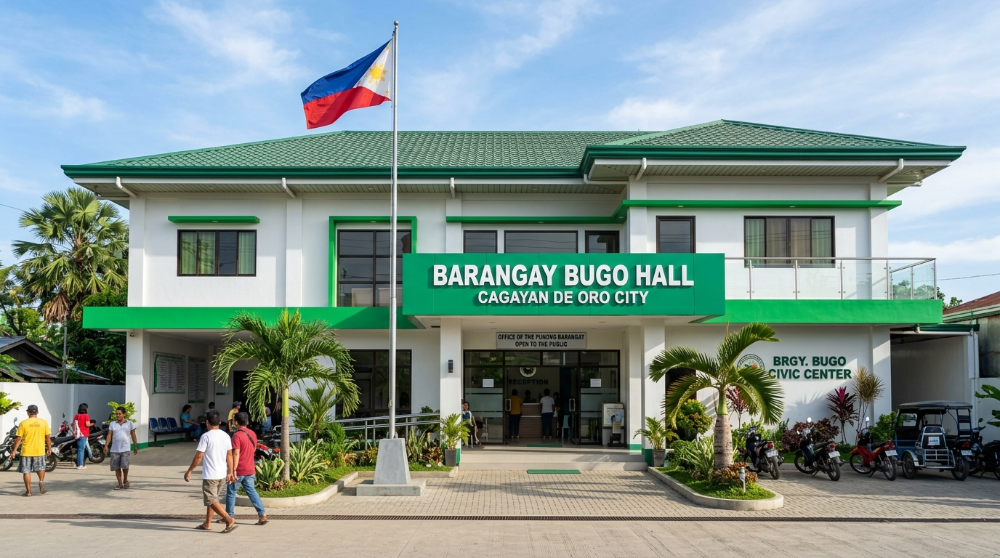

# Barangay Bugo Resident Assistance Management System

A modern, full-featured web-based resident assistance application, tracking, and record management system designed specifically for **Barangay Bugo, Cagayan de Oro City**.



---

## 📋 Table of Contents
- [Overview](#overview)
- [Key Features](#key-features)
  - [Resident Portal](#resident-portal)
  - [Administrative Operations](#administrative-operations)
  - [Record Management & Archival](#record-management--archival)
  - [Security & Access Control](#security--access-control)
- [Tech Stack](#tech-stack)
- [Project Structure](#project-structure)
- [Getting Started](#getting-started)
  - [Prerequisites](#prerequisites)
  - [Installation](#installation)
  - [Running the Development Server](#running-the-development-server)
  - [Building for Production](#building-for-production)
- [Pushing to GitHub](#pushing-to-github)
  - [Method 1: Using Git CLI (Recommended)](#method-1-using-git-cli-recommended)
  - [Method 2: Using GitHub Desktop](#method-2-using-github-desktop)
  - [Method 3: Direct Web Upload](#method-3-direct-web-upload)
- [Deployment Options](#deployment-options)
- [License & Credits](#license--credits)

---

## 🌟 Overview

The **Barangay Bugo Resident Assistance Management System** is built to modernize and digitize public service delivery at the grassroots level. It enables residents of Barangay Bugo to submit assistance requests, check program eligibility, view announcements, track application statuses, and obtain official digital clearances or vouchers. Simultaneously, it equips barangay officials and administrators with tools to process applications, log visitor movements (Time-In / Time-Out), manage blotter records, update program quotas, and maintain audit trails.

---

## 🚀 Key Features

### 👤 Resident Portal
- **User Authentication & Registration**: Easy onboarding with Purok assignment, contact verification, and valid ID document upload.
- **Assistance Programs Directory**: Browse available financial, educational, medical, and livelihood programs with clear eligibility criteria.
- **Application Wizard**: Step-by-step submission of assistance applications with document attachment support.
- **Live Application Tracking**: Real-time status indicators (*Pending*, *Under Review*, *Approved*, *Released*, *Rejected*).
- **Digital Claim Vouchers & QR Codes**: Instant generation of official claim vouchers with verification QR codes for authorized releases.
- **Resident Profile Management**: Manage personal details, household members count, registered voter status, and emergency contacts.

### 🛡️ Administrative Operations
- **Executive Dashboard**: High-level statistical summaries (total residents, pending requests, disbursed amounts, active programs).
- **Application Processing**: Review, approve, request additional documents, or decline resident applications with audit remarks.
- **Resident Registry & Verification**: Filter and verify registered residents, view submitted ID cards, or manage account restrictions.
- **Assistance Program Manager**: Add, edit, or archive assistance programs, update budget allocations, and configure beneficiary requirements.
- **Activity & Attendance Logger**: Monitor daily visitor traffic with automated resident lookup, Time-In / Time-Out recording, and officer logs.
- **Blotter & Incident Reports**: Digital documentation of barangay conciliation, incident logging, and summon schedules.
- **Official Barangay Clearances**: Streamlined clearance and indigency certificate requests and issuance.

### 🗄️ Record Management & Archival
- **Archival Vault**: Safe deletion with retention policies, recovery mechanisms, and deletion audit trails.
- **Exporting & Printing**: Print-friendly layouts for official certificates, vouchers, summary reports, and resident masterlists.
- **Global Search**: Instant keyboard-accessible search across residents, applications, programs, and activity logs.

---

## 🛠️ Tech Stack

- **Framework**: [React 19](https://react.dev/) + [TypeScript](https://www.typescriptlang.org/)
- **Build Tool**: [Vite 6](https://vitejs.dev/)
- **Styling**: [Tailwind CSS v4](https://tailwindcss.com/)
- **Icons**: [Lucide React](https://lucide.dev/)
- **Animations & Effects**: [Motion](https://motion.dev/), [Canvas-Confetti](https://www.npmjs.com/package/canvas-confetti)
- **Runtime**: Node.js 18+ or Bun

---

## 📁 Project Structure

```text
├── index.html                  # HTML entry point with meta & font tags
├── package.json                # Project dependencies and npm scripts
├── tsconfig.json               # TypeScript compiler configuration
├── vite.config.ts              # Vite configuration with Tailwind CSS & aliases
├── .env.example                # Example environment variable definitions
├── .gitignore                  # Git ignore rules for node_modules and builds
├── public/                     # Static assets and downloadable packages
│   ├── assets/                 # App assets
│   └── barangay-bugo-system.zip# Downloadable full project archive
└── src/
    ├── App.tsx                 # Root application router and layout dispatcher
    ├── main.tsx                # React root mount point
    ├── index.css               # Global Tailwind CSS and typography tokens
    ├── types.ts                # TypeScript data interfaces and types
    ├── context/
    │   └── AppContext.tsx      # Global application state management
    ├── data/
    │   └── mockData.ts         # Initial mock database & barangay programs
    ├── assets/
    │   └── images/             # Barangay hall photos and visual assets
    └── components/
        ├── TopNavBar.tsx       # Global top bar with search, notifications, export
        ├── BugoLogo.tsx        # Barangay Bugo official crest / seal logo
        ├── HeroSection.tsx     # Landing page hero with quick actions
        ├── FeaturedPrograms.tsx# Showcase of priority assistance programs
        ├── ApplicationWizard.tsx # Multi-step application submission
        ├── ClaimVoucherModal.tsx# Digital claim voucher with QR code
        ├── ProgramDetailModal.tsx # Program requirements and mechanics modal
        ├── ProgramsDirectory.tsx# Filterable directory of all assistance initiatives
        ├── ResidentProfile.tsx # Resident profile viewer and editor
        ├── admin/
        │   ├── AdminLayout.tsx         # Admin sidebar and page shell
        │   ├── AdminDashboardView.tsx  # KPI cards, charts, and quick actions
        │   ├── AdminOperationsViews.tsx# Tables for residents, apps, logs, blotter
        │   └── AdminArchivesView.tsx   # Archived records & recovery vault
        ├── auth/
        │   ├── LoginPage.tsx   # Login screen for residents and administrators
        │   ├── RegisterPage.tsx# Resident account creation with ID upload
        │   └── WelcomePage.tsx # Public portal landing page
        ├── guest/
        │   └── GuestPortalView.tsx # Public inquiry and program explorer
        └── resident/
            ├── ResidentLayout.tsx       # Resident dashboard shell
            └── ResidentOperationsViews.tsx # Resident application views
```

---

## 💻 Getting Started

### Prerequisites

Ensure you have one of the following installed on your machine:
- [Node.js](https://nodejs.org/) (version 18.0.0 or higher)
- [npm](https://www.npmjs.com/) (version 9 or higher) or [pnpm](https://pnpm.io/) or [Bun](https://bun.sh/)

### Installation

1. Clone or extract the project files:
   ```bash
   git clone https://github.com/<YOUR-USERNAME>/<YOUR-REPO-NAME>.git
   cd <YOUR-REPO-NAME>
   ```

2. Install dependencies:
   ```bash
   npm install
   ```

3. Configure environment variables (optional for local mock mode):
   ```bash
   cp .env.example .env
   ```

### Running the Development Server

Start Vite development server:
```bash
npm run dev
```

Open your browser and navigate to:
```
http://localhost:3000
```

### Building for Production

Compile the TypeScript code and generate optimized production assets in `/dist`:
```bash
npm run build
```

Preview the production build locally:
```bash
npm run preview
```

---

## 🐙 Pushing to GitHub

Follow these steps to upload this project to your GitHub account:

### Method 1: Using Git CLI (Recommended)

1. **Create a new repository on GitHub**:
   - Go to [github.com/new](https://github.com/new).
   - Enter a repository name (e.g., `barangay-bugo-assistance-system`).
   - Leave the repository **empty** (do **not** check "Add a README file" or ".gitignore").
   - Click **Create repository**.

2. **Open your terminal in the project folder and run**:
   ```bash
   # 1. Initialize git
   git init

   # 2. Stage all project files
   git add .

   # 3. Create your initial commit
   git commit -m "Initial commit: Barangay Bugo Resident Assistance Management System"

   # 4. Rename default branch to main
   git branch -M main

   # 5. Link your local project to your GitHub repository
   # (Replace with your actual GitHub username and repository name)
   git remote add origin https://github.com/YOUR_USERNAME/barangay-bugo-assistance-system.git

   # 6. Push your files to GitHub
   git push -u origin main
   ```

### Method 2: Using GitHub Desktop

1. Download and open [GitHub Desktop](https://desktop.github.com/).
2. Click **File** > **Add Local Repository...**.
3. Choose the extracted `barangay-bugo` folder.
4. If prompted that it's not a git repository, click **Create a Repository here**.
5. Click **Publish repository** to GitHub.

### Method 3: Direct Web Upload (No Git CLI Required)

1. Download the `barangay-bugo-system.zip` file directly from this app.
2. Extract the ZIP file on your computer.
3. On GitHub, create a new repository at [github.com/new](https://github.com/new).
4. Click on the link: **"uploading an existing file"**.
5. Drag and drop all the extracted files and folders (except `node_modules`).
6. Click **Commit changes**.

---

## 🌐 Deployment Options

This app is a static SPA that can be deployed to any modern web hosting service in seconds:

- **Vercel**: Import your GitHub repository into [Vercel](https://vercel.com). Framework preset: `Vite`. Build command: `npm run build`, Output directory: `dist`.
- **Netlify**: Connect your GitHub repo on [Netlify](https://netlify.com). Publish directory: `dist`.
- **GitHub Pages**: Build the project and deploy via GitHub Actions.
- **Render / Cloud Run / Railway**: Deploy as a static web service or container.

---

## 📄 License & Credits

- Developed for the community of **Barangay Bugo, Cagayan de Oro City, Philippines**.
- Built with React, Vite, and Tailwind CSS.
